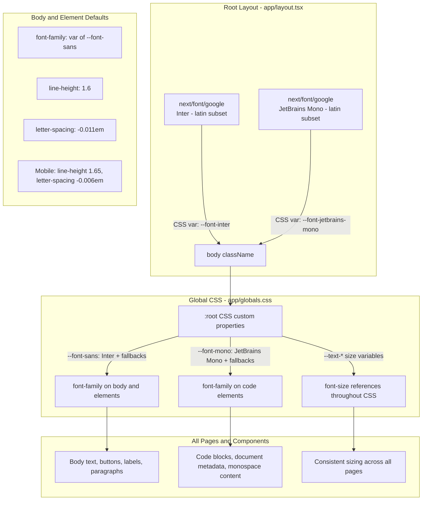

# Inter Font Implementation Plan — Next.js LMS Project (Vanilla CSS)

> A generic, project-agnostic guide for properly implementing Inter as the primary font in any Next.js (App Router) LMS codebase using **vanilla CSS** (no Tailwind, no CSS frameworks). Optimized for text-heavy, mobile-first reading experiences.

---

## Prerequisites

- Next.js 14+ with App Router
- Vanilla CSS (no Tailwind, no CSS framework)
- No external font dependencies required (Inter is on Google Fonts, loaded via `next/font`)

---

## Architecture Overview



---

## Implementation Steps

### Step 1: Configure Font Loading in Root Layout

**File:** `app/layout.tsx`

Import both Inter and JetBrains Mono from `next/font/google`. Register them as CSS custom properties and apply to the `<body>`.

```tsx
import type { Metadata } from 'next';
import { Inter, JetBrains_Mono } from 'next/font/google';
import './globals.css';

const inter = Inter({
  subsets: ['latin'],
  variable: '--font-inter',
});

const jetbrainsMono = JetBrains_Mono({
  subsets: ['latin'],
  variable: '--font-jetbrains-mono',
});

export const metadata: Metadata = {
  title: 'LMS Platform',
  description: 'Learning Management System',
};

export default function RootLayout({
  children,
}: Readonly<{
  children: React.ReactNode;
}>) {
  return (
    <html lang="en">
      <body className={`${inter.variable} ${jetbrainsMono.variable}`}>
        {children}
      </body>
    </html>
  );
}
```

**Key points:**

- `next/font/google` self-hosts the font files — no external network requests, no CLS, no FOUT
- `subsets: ["latin"]` keeps the download small (~20KB for Inter)
- The `variable` prop creates a CSS custom property (e.g., `--font-inter`) that your CSS can reference
- Do NOT add any other font imports in nested layouts — this root layout is the single source of truth
- Add any providers, toasters, or other wrappers inside `<body>` as your project requires

---

### Step 2: Remove Any Duplicate Font Imports

**File:** Any nested layout files (e.g., `app/(dashboard)/layout.tsx`, `app/(auth)/layout.tsx`)

Search the entire `app/` directory for any other files that import fonts from `next/font/google` or `next/font/local`. Remove those imports and variable declarations — the root layout already loads the fonts for the entire application.

**Before (nested layout):**

```tsx
import { Inter } from 'next/font/google';

const inter = Inter({
  subsets: ['latin'],
  variable: '--font-inter',
});

// ... used in className={`${inter.variable}`}
```

**After (nested layout):**

```tsx
// No font imports needed — inherited from root layout
```

> **Why:** Next.js deduplicates the actual font files, but duplicate declarations add unnecessary code and create confusion about where fonts are configured. The single source of truth should be the root layout only.

---

### Step 3: Define Font System in Global CSS

**File:** `app/globals.css` (or your main CSS entry point)

Add CSS custom properties for font families, a type scale, and mobile-optimized body defaults. Replace any existing font-related `:root` variables or `body` styles.

```css
/* ============================================
   FONT SYSTEM — Inter + JetBrains Mono
   ============================================ */

:root {
  /* --- Font Families --- */
  --font-sans:
    var(--font-inter), ui-sans-serif, system-ui, -apple-system,
    BlinkMacSystemFont, 'Segoe UI', Roboto, 'Helvetica Neue', Arial, sans-serif;
  --font-mono:
    var(--font-jetbrains-mono), ui-monospace, SFMono-Regular, 'SF Mono', Menlo,
    Consolas, 'Liberation Mono', monospace;

  /* --- Type Scale (mobile-first) --- */
  --text-xs: 0.75rem; /* 12px */
  --text-sm: 0.875rem; /* 14px */
  --text-base: 1rem; /* 16px — minimum body size for mobile */
  --text-lg: 1.125rem; /* 18px */
  --text-xl: 1.25rem; /* 20px */
  --text-2xl: 1.5rem; /* 24px */
  --text-3xl: 1.875rem; /* 30px */
  --text-4xl: 2.25rem; /* 36px */
  --text-5xl: 3rem; /* 48px */
  --text-6xl: 3.75rem; /* 60px */

  /* --- Font Weights (Inter supports 100–900) --- */
  --font-thin: 100;
  --font-extralight: 200;
  --font-light: 300;
  --font-normal: 400;
  --font-medium: 500;
  --font-semibold: 600;
  --font-bold: 700;
  --font-extrabold: 800;
  --font-black: 900;

  /* --- Line Heights --- */
  --leading-none: 1;
  --leading-tight: 1.25;
  --leading-snug: 1.375;
  --leading-normal: 1.5;
  --leading-relaxed: 1.6;
  --leading-loose: 1.75;

  /* --- Letter Spacing --- */
  --tracking-tighter: -0.05em;
  --tracking-tight: -0.025em;
  --tracking-normal: 0em;
  --tracking-wide: 0.025em;
  --tracking-wider: 0.05em;
  --tracking-widest: 0.1em;
}

/* --- Body Defaults (Desktop) --- */
body {
  font-family: var(--font-sans);
  font-size: var(--text-base);
  font-weight: var(--font-normal);
  line-height: var(--leading-relaxed);
  letter-spacing: -0.011em;
  -webkit-font-smoothing: antialiased;
  -moz-osx-font-smoothing: grayscale;
  text-rendering: optimizeLegibility;
}

/* --- Mobile Adjustments --- */
@media (max-width: 640px) {
  body {
    line-height: 1.65;
    letter-spacing: -0.006em;
  }
}

/* --- Monospace Elements --- */
code,
pre,
kbd,
samp {
  font-family: var(--font-mono);
}

/* --- Heading Defaults --- */
h1,
h2,
h3,
h4,
h5,
h6 {
  font-family: var(--font-sans);
  font-weight: var(--font-semibold);
  line-height: var(--leading-tight);
  letter-spacing: -0.025em;
}
```

**Design decisions explained:**

| Setting                            | Value                                                                                                                  | Rationale                                                                       |
| ---------------------------------- | ---------------------------------------------------------------------------------------------------------------------- | ------------------------------------------------------------------------------- |
| `--font-sans` fallback chain       | `ui-sans-serif, system-ui, -apple-system, BlinkMacSystemFont, "Segoe UI", Roboto, "Helvetica Neue", Arial, sans-serif` | Comprehensive system font fallbacks for every OS                                |
| `--font-mono` fallback chain       | `ui-monospace, SFMono-Regular, "SF Mono", Menlo, Consolas, "Liberation Mono", monospace`                               | Cross-platform monospace fallbacks                                              |
| `line-height: 1.6`                 | Desktop body                                                                                                           | Inter's tall x-height works well with slightly tighter leading than typical 1.7 |
| `letter-spacing: -0.011em`         | Desktop body                                                                                                           | Inter's author recommends slight negative tracking for UI text                  |
| `line-height: 1.65`                | Mobile body                                                                                                            | Looser leading improves readability on narrow viewports                         |
| `letter-spacing: -0.006em`         | Mobile body                                                                                                            | Less aggressive tracking on small screens prevents cramped feel                 |
| `font-size: 1rem`                  | Body                                                                                                                   | 16px minimum — WCAG recommends at least 16px for mobile body text               |
| Heading `letter-spacing: -0.025em` | h1–h6                                                                                                                  | Tighter tracking for headings gives a more refined, professional look           |
| Heading `line-height: 1.25`        | h1–h6                                                                                                                  | Tighter leading for headings is standard typographic practice                   |

---

### Step 4: How to Use the Font System in Components

With vanilla CSS, you reference the custom properties in your CSS files or CSS modules. Here are the patterns:

#### Pattern A: Using the type scale in CSS

```css
/* In any CSS file or CSS module */
.card-title {
  font-size: var(--text-xl);
  font-weight: var(--font-semibold);
  line-height: var(--leading-tight);
}

.card-body {
  font-size: var(--text-base);
  font-weight: var(--font-normal);
  line-height: var(--leading-relaxed);
}

.card-caption {
  font-size: var(--text-sm);
  color: #6b7280;
}
```

#### Pattern B: Using the type scale with inline styles (if needed)

```tsx
// Only use inline styles when CSS classes aren't practical
<h1 style={{ fontSize: 'var(--text-4xl)', fontWeight: 'var(--font-bold)' }}>
  Course Title
</h1>
```

#### Pattern C: Monospace for code/data

```css
.code-block {
  font-family: var(--font-mono);
  font-size: var(--text-sm);
  line-height: var(--leading-normal);
}

.data-table td {
  font-family: var(--font-mono);
  font-size: var(--text-sm);
}
```

#### Type Scale Reference for Components

| Variable           | Size | Use Case                                 |
| ------------------ | ---- | ---------------------------------------- |
| `var(--text-xs)`   | 12px | Captions, timestamps, fine print         |
| `var(--text-sm)`   | 14px | Secondary text, helper text, table cells |
| `var(--text-base)` | 16px | Body text, form inputs, buttons          |
| `var(--text-lg)`   | 18px | Large body, subheadings                  |
| `var(--text-xl)`   | 20px | Section titles, card headings            |
| `var(--text-2xl)`  | 24px | Page headings                            |
| `var(--text-3xl)`  | 30px | Hero subtext                             |
| `var(--text-4xl)`  | 36px | Hero headings                            |
| `var(--text-5xl)`  | 48px | Large display text                       |
| `var(--text-6xl)`  | 60px | Hero display / marketing pages           |

---

### Step 5: Clean Up Dead Font References

Search the entire codebase for any of these and remove or replace them:

```bash
# Search for common dead references
grep -rn "font-family:" app/ components/ src/
grep -rn "@font-face" app/ components/ src/
grep -rn "style={{ fontFamily" app/ components/ src/
grep -rn "import.*font" app/ components/ src/
```

**What to look for and fix:**

| What to Find                                                          | What to Do                                         |
| --------------------------------------------------------------------- | -------------------------------------------------- |
| `@font-face` declarations for Inter or other sans-serif fonts         | Remove — `next/font` handles this automatically    |
| `font-family: "Inter"` or `font-family: 'Inter'` hardcoded in CSS     | Replace with `font-family: var(--font-sans)`       |
| `font-family: -apple-system, ...` system font stacks in CSS           | Replace with `font-family: var(--font-sans)`       |
| `style={{ fontFamily: "..." }}` inline styles in TSX/JSX              | Remove and use CSS classes with `var(--font-sans)` |
| Any `next/font/google` or `next/font/local` imports in nested layouts | Remove — only root layout should import fonts      |
| Google Fonts `<link>` tags in HTML head                               | Remove — `next/font` replaces these                |

---

### Step 6: Verify and Test

#### DevTools Verification

1. Open DevTools → Elements → `<body>`
2. Check Computed `font-family` — should show `Inter`
3. Check Computed `font-size` — should show `16px`
4. Check Computed `line-height` — should show `25.6px` (1.6 × 16px on desktop)
5. Check Network tab — **no external Google Fonts requests** (fonts are self-hosted by Next.js)
6. Check `<head>` — should see `<style>` tags with `@font-face` for Inter and JetBrains Mono

#### Visual Checklist

| Area        | What to Check                                                | Expected                                  |
| ----------- | ------------------------------------------------------------ | ----------------------------------------- |
| Body text   | Render a paragraph with no classes                           | Inter, 16px, line-height 1.6              |
| Headings    | Check h1–h6 rendering                                        | Inter, semibold, tighter tracking         |
| Code blocks | Any `<code>` or element with `font-family: var(--font-mono)` | JetBrains Mono                            |
| Mobile      | View at 375px and 414px width                                | line-height 1.65, slightly looser spacing |
| Dark mode   | Toggle dark mode if applicable                               | Font rendering stays crisp                |
| Page load   | Hard refresh with Network tab open                           | No external font requests                 |
| CLS         | Run Lighthouse performance audit                             | 0 CLS from font loading                   |

#### Quick Test Page

Create a temporary route (e.g., `app/font-test/page.tsx`) to verify everything works:

```tsx
export default function FontTest() {
  return (
    <div style={{ padding: '2rem', maxWidth: '800px', margin: '0 auto' }}>
      <h1>Font System Test</h1>

      <p>
        This is body text. It should render in Inter at 16px with line-height
        1.6.
      </p>

      <p style={{ fontSize: 'var(--text-xs)' }}>XS — 12px caption text</p>
      <p style={{ fontSize: 'var(--text-sm)' }}>SM — 14px small text</p>
      <p style={{ fontSize: 'var(--text-base)' }}>Base — 16px body text</p>
      <p style={{ fontSize: 'var(--text-lg)' }}>LG — 18px large text</p>
      <p style={{ fontSize: 'var(--text-xl)' }}>XL — 20px section title</p>
      <p style={{ fontSize: 'var(--text-2xl)' }}>2XL — 24px heading</p>
      <p style={{ fontSize: 'var(--text-3xl)' }}>3XL — 30px</p>
      <p style={{ fontSize: 'var(--text-4xl)' }}>4XL — 36px</p>

      <code>This should be JetBrains Mono</code>

      <pre
        style={{ fontFamily: 'var(--font-mono)', fontSize: 'var(--text-sm)' }}
      >
        {`const example = "monospace text";
console.log(example);`}
      </pre>
    </div>
  );
}
```

Visit the page, verify rendering, then delete the test route.

---

## Files Modified Summary

| File                                           | Change                                                                                                               |
| ---------------------------------------------- | -------------------------------------------------------------------------------------------------------------------- |
| `app/layout.tsx`                               | Add Inter + JetBrains Mono imports; apply both CSS variables to `<body>` className                                   |
| `app/globals.css`                              | Add `:root` custom properties for fonts, type scale, weights, leading, tracking; set body/heading/monospace defaults |
| Any nested layouts                             | Remove duplicate font imports                                                                                        |
| Any CSS files with hardcoded `font-family`     | Replace with `var(--font-sans)` or `var(--font-mono)`                                                                |
| Any components with inline `fontFamily` styles | Remove and use CSS classes                                                                                           |

**No new files created. No npm packages added.**

---

## Optional: Migrating Hardcoded Font Sizes

If the codebase has hardcoded pixel values in CSS like `font-size: 26px`, `font-size: 19.59px`, etc., migrate them to the type scale variables:

| Hardcoded         | Replace With                  | Notes                |
| ----------------- | ----------------------------- | -------------------- |
| `font-size: 12px` | `font-size: var(--text-xs)`   | Exact match          |
| `font-size: 13px` | `font-size: var(--text-sm)`   | Closest match (14px) |
| `font-size: 14px` | `font-size: var(--text-sm)`   | Exact match          |
| `font-size: 15px` | `font-size: var(--text-base)` | Closest match (16px) |
| `font-size: 16px` | `font-size: var(--text-base)` | Exact match          |
| `font-size: 17px` | `font-size: var(--text-lg)`   | Closest match (18px) |
| `font-size: 18px` | `font-size: var(--text-lg)`   | Exact match          |
| `font-size: 20px` | `font-size: var(--text-xl)`   | Exact match          |
| `font-size: 24px` | `font-size: var(--text-2xl)`  | Exact match          |
| `font-size: 26px` | `font-size: var(--text-2xl)`  | Closest match (24px) |
| `font-size: 30px` | `font-size: var(--text-3xl)`  | Exact match          |
| `font-size: 36px` | `font-size: var(--text-4xl)`  | Exact match          |
| `font-size: 48px` | `font-size: var(--text-5xl)`  | Exact match          |
| `font-size: 60px` | `font-size: var(--text-6xl)`  | Exact match          |

> This migration is optional and can be done incrementally. The CSS custom properties will work alongside hardcoded pixel values without conflicts.

---

## Why Inter for an LMS

1. **Screen-first design** — Inter was built specifically for UI; its tall x-height and wide apertures maximize legibility at small sizes
2. **9 weights (100–900)** — Rich typographic hierarchy without loading extra font families
3. **Free and open source** — SIL Open Font License, no licensing costs ever
4. **Performance** — `next/font` self-hosts with automatic subsetting; ~20KB for latin subset
5. **Mobile optimized** — Larger apertures in letters like a, e, s prevent the filled-in look on low-DPI phone screens
6. **Extensive glyph coverage** — Latin, Cyrillic, and Greek scripts out of the box
7. **Industry standard** — Used by GitHub, Vercel, Tailwind CSS, and thousands of SaaS products
8. **Long-form reading** — Generous spacing and open counters reduce eye fatigue during extended reading sessions (critical for LMS content)
