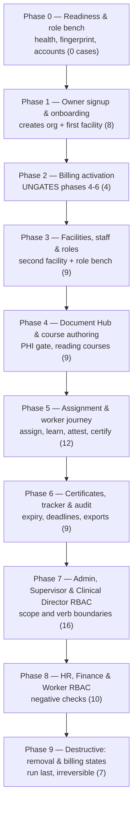

# Theraptly LMS — QA Testing Phases (2026-08-20)

> Companion to [`qa-test-cases-08-20.md`](./qa-test-cases-08-20.md). Its **84 test cases** run in
> **nine sequential phases** plus a setup phase, ordered so that each phase's preconditions are
> produced by an earlier phase. Every case belongs to exactly one phase. Each phase is a single
> `qa-tester` run producing a single report.
>
> **Target:** `https://staging-lms.theraptly.com` · **Executor:** the `qa-tester` plugin (`/qa`) ·
> **Reports:** `qa-reports/2026-08-20/` (gitignored)

## Why this order

The source export is organised by role. That is the right reading order but the wrong execution
order, because preconditions flow **across** roles — the worker completion chain feeds the
certificate and Status Tracker cases, which in turn feed the audit cases. Three hard constraints
determine the sequence:

1. **Course creation and course assignment are both billing-gated.** Without an active subscription,
   "Create Course" only offers "A plan is required to create courses", and assignment throws. So
   **billing activation is Phase 2**, long before the destructive billing states.
2. **Cancel and pause are destructive to everything downstream.** Pausing flips access off for course
   creation and assignment, and disables auditor export. So **the destructive billing states are
   Phase 9**, after the audit cases have run.
3. **Staff removal is irreversible through the UI.** A removed user cannot be re-invited — invite
   creation dedupes on globally-existing users and skips them, while the user has no organization to
   log into. So **staff removal is also Phase 9**, on a throwaway account.



## Phase overview

| Phase | Focus                                      | Test case sections                             | TC IDs                                             | Count |
| ----- | ------------------------------------------ | ---------------------------------------------- | -------------------------------------------------- | ----- |
| 0     | Readiness & role bench                     | —                                              | —                                                  | 0     |
| 1     | Owner signup & onboarding                  | Owner — Onboarding                             | TC-OB-001 – TC-OB-008                              | 8     |
| 2     | Billing activation                         | Owner — Billing (non-destructive)              | TC-BILL-001, 004, 005, 006                         | 4     |
| 3     | Facilities, staff & roles                  | Owner — Settings, Staff Management, Admin      | TC-SET-001 – 005, TC-SM-001 – 003, TC-ADM-001      | 9     |
| 4     | Document Hub & course authoring            | Owner — Document Hub, Courses                  | TC-DH-001 – 004, TC-CRS-001 – 005                  | 9     |
| 5     | Assignment & worker journey                | Owner — Courses, Worker                        | TC-CRS-006 – 008, TC-SM-004, TC-WRK-001 – 008      | 12    |
| 6     | Certificates, tracker & audit              | Owner — Courses, Status Tracker, Audit Reports | TC-CRS-009, 010, TC-ST-001 – 004, TC-AR-001 – 003  | 9     |
| 7     | Admin, Supervisor & Clinical Director RBAC | Admin, Facility Supervisor, Clinical Director  | TC-ADM-002, 003, TC-SUP-001 – 008, TC-CD-001 – 006 | 16    |
| 8     | HR, Finance & Worker RBAC                  | HR, Finance, Worker                            | TC-HR-001 – 006, TC-FIN-001 – 003, TC-WRK-009      | 10    |
| 9     | Destructive: removal & billing states      | Staff Management, Billing                      | TC-SM-005, 006, TC-BILL-002, 003, 007, 008, 009    | 7     |

**Total: 84 test cases.**

Apply the General QA Guidelines from the catalog in every phase. Honour the per-case status flags —
`[SPEC-DRIFT]` cases are expected to FAIL and `[NOT-IMPL]` cases are expected to be BLOCKED; neither
should consume debugging time.

## Expected outcome before the run starts

A white-box read of the codebase during preparation predicted these results. They are recorded here
so the run can be judged against a baseline rather than treated as all-new discoveries.

| Phase | Predicted BLOCKED (`[NOT-IMPL]`)                        | Predicted FAIL (`[SPEC-DRIFT]`) |
| ----- | ------------------------------------------------------- | ------------------------------- |
| 1     | TC-OB-003                                               | —                               |
| 4     | —                                                       | TC-CRS-004                      |
| 5     | TC-CRS-008                                              | —                               |
| 6     | TC-CRS-009, TC-CRS-010, TC-ST-001, TC-ST-004, TC-AR-003 | —                               |
| 3     | TC-SET-005                                              | —                               |
| 7     | —                                                       | TC-SUP-003, TC-SUP-004          |
| 9     | —                                                       | TC-BILL-007, TC-BILL-008        |

**Baseline: 8 BLOCKED, 5 FAIL, 71 expected PASS.** A result materially better or worse than this
baseline is itself the headline finding for the summary report.

---

## Phase 0 — Readiness & role bench

**Scope:** No test cases. Establish that the environment is testable and stand up the accounts every
later phase depends on.

**Checklist:**

1. `GET /api/health` — confirm `db` and `redis` are both connected. **Redis is mandatory**: audit
   exports in Phase 6 are background jobs that will not run without it.
2. Capture a **build fingerprint** — md5 of the `_next/static/chunks/*.js` set on `/login`, plus the
   uptime from `/api/health`. Re-check at the end of every phase. Staging has redeployed mid-run
   before, which invalidates results silently.
3. Confirm **Stripe is in test mode** — the `test_` URL segment and the Sandbox badge. Never enter a
   card before this check.
4. Confirm **PHI scanning credentials are live**. The scanner is fail-closed: if Vertex AI is
   unreachable, every Phase 4 upload is blocked for the wrong reason.
5. Confirm the QA inbox is reachable (`QA_EMAIL` / `QA_EMAIL_PASSWORD` in `.env.local` — strip the app
   password's spaces; never `source` the file).
6. Stand up the **role bench**. Staging carries no seed fixtures, so local dev credentials do not
   exist there. Self-signup always creates an Owner; every other role comes from an invite. Use Gmail
   `+alias` addressing so all mail lands in the one QA inbox.

**Bench required by later phases:** owner (Phase 1 creates this), admin, supervisor, hr,
clinical_director, finance, plus at least two workers — one for the full completion journey and one
disposable for Phase 9's removal case.

**Rate limit:** login is capped at 10 attempts per IP per 15 minutes and fails closed. Space out bench
logins or the phase stalls.

**Exit condition:** health green, fingerprint recorded, Stripe test mode confirmed, and every bench
account able to log in.

---

## Phase 1 — Owner signup & onboarding

**Scope:** The full owner signup and 5-step onboarding flow, including both CSV import paths.

| Section                                                          | Test cases            |
| ---------------------------------------------------------------- | --------------------- |
| [Owner — Onboarding](./qa-test-cases-08-20.md#owner--onboarding) | TC-OB-001 – TC-OB-008 |

**Why here:** Nothing else can run first. This creates the organization, its first facility, and the
owner account that every subsequent phase authenticates as.

**Watch for:** Onboarding state is client-side and assembled at final submit — walk step1 → step5 in
**one browser session** or completion fails with "Missing Organization Data (Step 1)". The Radix
comboboxes on steps 1, 2, 3, 4 and 5 only bind via **keyboard** (focus, Enter, ArrowDown,
Space/Enter, Escape); mouse clicks silently fail to commit. Neither is a product bug.

**Expected:** TC-OB-003 BLOCKED (no facility-type field exists in onboarding; its assertion is
re-homed to TC-SET-001 in Phase 3). All others PASS.

**Exit condition:** An organization exists with a first facility, the owner reaches `/dashboard`, and
the staff invited during steps 4–5 appear in Staff Management.

```
/qa https://staging-lms.theraptly.com Phase 1 — Owner signup & onboarding.
Execute TC-OB-001 through TC-OB-008 from docs/qa-test-cases-08-20.md exactly as written,
including each case's Notes.
Sign up a new Owner using a Gmail +alias on the QA inbox; retrieve the verification link from
that inbox. Walk onboarding step1 -> step5 in ONE browser session.
Honour the status flags: [SPEC-DRIFT] cases are expected to FAIL — record actual and move on,
do not debug. [NOT-IMPL] cases -> BLOCKED, do not hunt for the UI.
Record the build fingerprint at start and end.
Write the report to qa-reports/2026-08-20/phase-1-owner-onboarding.md
```

---

## Phase 2 — Billing activation

**Scope:** Subscribing to a plan and the non-destructive billing surfaces — seat-banded plan
selection, payment method, invoices.

| Section                                                    | Test cases                                         |
| ---------------------------------------------------------- | -------------------------------------------------- |
| [Owner — Billing](./qa-test-cases-08-20.md#owner--billing) | TC-BILL-001, TC-BILL-004, TC-BILL-005, TC-BILL-006 |

**Why here:** This is the phase everything downstream depends on. `hasActiveBilling` gates course
creation **and** course assignment, so Phases 4, 5 and 6 cannot run at all without an active
subscription. It sits second only because it needs the organization from Phase 1.

**Watch for:** Confirm test mode before entering any card; use `4242 4242 4242 4242`. The card is
entered on **Stripe's hosted portal, off-app**. TC-BILL-004 keys off the facility's _declared_ staff
count from onboarding, **not** the live roster — a distinction that separates it from TC-BILL-008 in
Phase 9.

**Exit condition:** The organization holds an **active** subscription, a payment method is on file,
and at least one invoice exists. Do not proceed otherwise — Phases 4–6 will fail wholesale.

```
/qa https://staging-lms.theraptly.com Phase 2 — Billing activation.
Execute TC-BILL-001, TC-BILL-004, TC-BILL-005, TC-BILL-006 from docs/qa-test-cases-08-20.md
exactly as written, including each case's Notes.
CONFIRM Stripe is in TEST mode (test_ URL segment + Sandbox badge) BEFORE entering any card.
Use 4242 4242 4242 4242. Do NOT cancel, pause or downgrade — those are Phase 9.
This phase MUST end with an ACTIVE subscription; state clearly in the report whether it did.
Honour the status flags as described in the catalog.
Write the report to qa-reports/2026-08-20/phase-2-billing-activation.md
```

---

## Phase 3 — Facilities, staff & roles

**Scope:** Facility CRUD in Settings, the Staff Management table and profile, invite-based staff
creation, and the Admin role grant.

| Section                                                                      | Test cases              |
| ---------------------------------------------------------------------------- | ----------------------- |
| [Owner — Settings](./qa-test-cases-08-20.md#owner--settings)                 | TC-SET-001 – TC-SET-005 |
| [Owner — Staff Management](./qa-test-cases-08-20.md#owner--staff-management) | TC-SM-001 – TC-SM-003   |
| [Admin](./qa-test-cases-08-20.md#admin)                                      | TC-ADM-001              |

**Why here:** It produces the **second facility** and the **role bench** that Phases 7 and 8 test
against. The supervisor invited in TC-SET-002 is the precondition for TC-SUP-001/002. Running it
before content phases also means courses can be assigned to real staff later.

**Watch for:** Settings is Owner/Admin only, and facility management is the **Facility** tab (there
is no `/dashboard/settings/facilities` route). Verify TC-OB-003's dropdown assertion here as part of
TC-SET-001. Staff creation is **invite-based**, so each new member needs its invite accepted at
`/join/<token>` — and the Terms checkbox there is a Radix control that must be clicked by role.

**Expected:** TC-SET-005 FAIL or unverified — the agreed intent is that deleting a facility with
staff is blocked, but the implementation was not confirmed during preparation. Record precisely what
happens.

**Exit condition:** Two facilities exist, the staff table renders correctly, and the full role bench
(admin, supervisor, hr, clinical_director, finance, workers) is invited and accepted.

```
/qa https://staging-lms.theraptly.com Phase 3 — Facilities, staff & roles.
Execute TC-SET-001..005, TC-SM-001..003, TC-ADM-001 from docs/qa-test-cases-08-20.md exactly as
written, including each case's Notes.
Log in as the Owner from Phase 1. Create a SECOND facility. Invite one user per role
(admin, supervisor, hr, clinical_director, finance) plus two workers (front_desk_admin or nurse)
using Gmail +alias addresses, and ACCEPT each invite at /join/<token> in its own browser session
so Phases 7-9 have a working role bench. On the accept form the Terms checkbox is Radix — click
it by role, not the native input.
Under TC-SET-001 also verify the facility-type control is a predefined dropdown, and record that
result against TC-OB-003 as well.
Honour the status flags as described in the catalog.
Write the report to qa-reports/2026-08-20/phase-3-facilities-staff-roles.md
```

---

## Phase 4 — Document Hub & course authoring

**Scope:** The PHI upload gate and its disclaimer, plus reading-course creation, update, and details.

| Section                                                              | Test cases              |
| -------------------------------------------------------------------- | ----------------------- |
| [Owner — Document Hub](./qa-test-cases-08-20.md#owner--document-hub) | TC-DH-001 – TC-DH-004   |
| [Owner — Courses](./qa-test-cases-08-20.md#owner--courses)           | TC-CRS-001 – TC-CRS-005 |

**Why here:** It needs the active subscription from Phase 2, and it produces the courses that Phase 5
assigns.

**Watch for:** The clean test document must contain **no email address and no phone number** — both
are hard-blocked by a local regex before any AI call, so an innocuous letterhead footer fails the
test. Fixtures live at `docs/local/test-fixtures/`. Publishing a course opens a **Confirm Course
Review** modal; navigating away without confirming creates nothing.

**Expected:** TC-CRS-004 FAIL — pre-built courses are still present at three entry points. Capture
all three as evidence.

**Exit condition:** At least one non-PHI document is stored, at least one reading course is published,
and the pre-built removal claim has a definitive verdict.

```
/qa https://staging-lms.theraptly.com Phase 4 — Document Hub & course authoring.
Execute TC-DH-001..004 and TC-CRS-001..005 from docs/qa-test-cases-08-20.md exactly as written,
including each case's Notes.
Log in as the Owner. BEFORE starting, confirm PHI scanning is functional — the scanner is
fail-closed, so if Vertex AI is unreachable every upload is blocked for the wrong reason; say so
in the report rather than recording four false failures.
The clean test document must contain NO email address and NO phone number. Use
docs/local/test-fixtures/ if available.
TC-CRS-004 is [SPEC-DRIFT] and expected to FAIL — capture all three pre-built entry points as
evidence, then move on.
Honour the status flags as described in the catalog.
Write the report to qa-reports/2026-08-20/phase-4-documents-courses.md
```

---

## Phase 5 — Assignment & worker journey

**Scope:** The three assignment modes, then the complete worker path from invite email through
learning, assessment, retake, attestation and certificate.

| Section                                                                      | Test cases              |
| ---------------------------------------------------------------------------- | ----------------------- |
| [Owner — Courses](./qa-test-cases-08-20.md#owner--courses)                   | TC-CRS-006 – TC-CRS-008 |
| [Owner — Staff Management](./qa-test-cases-08-20.md#owner--staff-management) | TC-SM-004               |
| [Worker](./qa-test-cases-08-20.md#worker)                                    | TC-WRK-001 – TC-WRK-008 |

**Why here:** It consumes Phase 4's courses and Phase 3's staff, and it produces the completed
enrollments and certificates that Phase 6 inspects. This is the longest phase and the one most likely
to surface blocking defects.

**Watch for — three traps that have each cost a previous run:**

- **Set a due date within 7 days** on the TC-CRS-006 assignment. Status Tracker only shows overdue
  and due-within-7-days rows; blank dates auto-compute roughly +31 days, which makes both TC-CRS-006
  and the Phase 6 tracker cases fail spuriously.
- **Set the worker's full name** before attestation. Certificate issuance hard-fails without it.
- **Check the attestation button first.** It has previously been gated on a strict match against the
  literal role `worker`, which no real user holds. When that bug is present it never renders, and
  TC-WRK-006, 007 and 008 are all unreachable — mark the three BLOCKED against **one** root cause
  rather than filing three separate defects.

**Expected:** TC-CRS-008 BLOCKED (no facility assign target); substitute the assign-to-role path and
record it as supplementary evidence.

**Exit condition:** At least one worker holds an issued certificate, and at least one assignment is
due inside 7 days for Phase 6.

```
/qa https://staging-lms.theraptly.com Phase 5 — Assignment & worker journey.
Execute TC-CRS-006..008, TC-SM-004 and TC-WRK-001..008 from docs/qa-test-cases-08-20.md exactly as written,
including each case's Notes.
CRITICAL SETUP: give the TC-CRS-006 assignment a due date WITHIN 7 DAYS (blank auto-computes
~+31d and the row never reaches Status Tracker), and set the worker's FULL NAME on their profile
before attestation (certificate issuance hard-fails without it).
Check the attestation button early: if it does not render for a real worker sub-role
(nurse / front_desk_admin), mark TC-WRK-006/007/008 BLOCKED against ONE root cause.
TC-CRS-008 is [NOT-IMPL] -> BLOCKED; instead exercise assign-to-ROLE and record it as
supplementary evidence.
Leave at least one assignment due inside 7 days for Phase 6.
Honour the status flags as described in the catalog.
Write the report to qa-reports/2026-08-20/phase-5-assignment-worker-journey.md
```

---

## Phase 6 — Certificates, Status Tracker & audit

**Scope:** Certificate expiry and the compliance flip, the tracker's deadline populations, and the
audit exports.

| Section                                                                  | Test cases             |
| ------------------------------------------------------------------------ | ---------------------- |
| [Owner — Courses](./qa-test-cases-08-20.md#owner--courses)               | TC-CRS-009, TC-CRS-010 |
| [Owner — Status Tracker](./qa-test-cases-08-20.md#owner--status-tracker) | TC-ST-001 – TC-ST-004  |
| [Owner — Audit Reports](./qa-test-cases-08-20.md#owner--audit-reports)   | TC-AR-001 – TC-AR-003  |

**Why here:** It reads the state Phase 5 produced. It must run **before** Phase 9, because pausing or
cancelling a subscription disables auditor export entirely.

**Watch for:** Exports are async background jobs requiring Redis, and **only one may be in flight at
a time** — run TC-AR-001 to completion before starting TC-AR-002. The UI hardcodes CSV even though
the banner and the API default suggest PDF.

**Expected — this is the heaviest gap phase, 5 of 9 cases predicted BLOCKED:** TC-CRS-009, TC-CRS-010
and TC-ST-004 all share **one root cause** — the certificate model has no expiry column, so there is
nothing to display and nothing to drive a compliance flip. File them as a single defect with three
affected cases. TC-ST-001 is blocked separately (no active/in-progress view exists). TC-AR-003 is
blocked separately (no facility filter exists). TC-ST-002 and TC-ST-003 should pass, but as **badges
in one merged table**, not as filters.

**Exit condition:** Both exports have downloaded and been content-checked, and every expiry-related
case has a recorded BLOCKED verdict traced to the missing schema field.

```
/qa https://staging-lms.theraptly.com Phase 6 — Certificates, Status Tracker & audit.
Execute TC-CRS-009, TC-CRS-010, TC-ST-001..004, TC-AR-001..003 from docs/qa-test-cases-08-20.md
exactly as written, including each case's Notes.
Confirm /api/health shows redis connected before starting — exports are background jobs and will
not run without it. Only ONE export may be in flight at a time; finish TC-AR-001 before starting
TC-AR-002, and open the downloaded file to verify its CONTENT, not just that it downloaded.
Five cases are predicted BLOCKED. TC-CRS-009, TC-CRS-010 and TC-ST-004 share ONE root cause (the
Certificate model has no expiry column) — file them as a single defect with three affected cases,
not three defects. TC-ST-001 and TC-AR-003 are separate [NOT-IMPL] blocks.
For TC-AR-003, exercise the Status Tracker facility scope switcher instead and record it as
supplementary evidence.
Do NOT cancel or pause the subscription — that is Phase 9 and would disable auditor export.
Write the report to qa-reports/2026-08-20/phase-6-certificates-tracker-audit.md
```

---

## Phase 7 — Admin, Supervisor & Clinical Director RBAC

**Scope:** The verb-and-scope boundaries of the three manager roles that are not HR or Finance.

| Section                                                             | Test cases              |
| ------------------------------------------------------------------- | ----------------------- |
| [Admin](./qa-test-cases-08-20.md#admin)                             | TC-ADM-002, TC-ADM-003  |
| [Facility Supervisor](./qa-test-cases-08-20.md#facility-supervisor) | TC-SUP-001 – TC-SUP-008 |
| [Clinical Director](./qa-test-cases-08-20.md#clinical-director)     | TC-CD-001 – TC-CD-006   |

**Why here:** RBAC negatives need real content and real staff to attempt access against — both exist
only after Phases 3–6. The supervisor account comes from TC-SET-002 in Phase 3.

**Watch for:** Facility scoping is driven by a **URL parameter, not the session token**, and an
inaccessible facility id silently widens to "all" rather than erroring — probe that directly for
TC-SUP-005 through TC-SUP-008. For every negative case, **probe the API endpoint directly, not just
the page**: this codebase's recurring defect is that page bodies are correctly gated while the
underlying routes use a coarse "is admin role" check that admits all manager roles.

**Expected:** TC-SUP-003 and TC-SUP-004 FAIL. The supervisor is read-only by design in the current
code (read on everything except billing, plus a small self-service set), so it cannot edit facilities
or assign courses. These two cases encode the older business expectation and their failure is the
finding — record whether each control is hidden, disabled, or present-but-rejected, since that
distinction drives the fix.

**Exit condition:** Every supervisor scope boundary has been probed by direct URL/ID manipulation as
well as through the UI, and the Clinical Director permission set has a verdict on all six cases.

```
/qa https://staging-lms.theraptly.com Phase 7 — Admin, Supervisor & Clinical Director RBAC.
Execute TC-ADM-002, TC-ADM-003, TC-SUP-001..008, TC-CD-001..006 from
docs/qa-test-cases-08-20.md exactly as written, including each case's Notes.
Use the admin, supervisor and clinical_director accounts from the Phase 3 bench.
For EVERY negative case, probe the API route directly as well as the page — the known recurring
defect in this codebase is a correctly-gated page body sitting on an ungated endpoint.
TC-SUP-003 and TC-SUP-004 are [SPEC-DRIFT] and expected to FAIL (supervisor is read-only in
current code). Record whether each control is hidden, disabled, or present-but-rejected — that
distinction matters. Do not debug them.
Note Admin legitimately HAS billing access; that is not a defect.
Write the report to qa-reports/2026-08-20/phase-7-admin-supervisor-clinical-rbac.md
```

---

## Phase 8 — HR, Finance & Worker RBAC

**Scope:** HR's org-wide capabilities, Finance's billing-only boundary, and the worker's hard block
from admin surfaces.

| Section                                     | Test cases              |
| ------------------------------------------- | ----------------------- |
| [HR](./qa-test-cases-08-20.md#hr)           | TC-HR-001 – TC-HR-006   |
| [Finance](./qa-test-cases-08-20.md#finance) | TC-FIN-001 – TC-FIN-003 |
| [Worker](./qa-test-cases-08-20.md#worker)   | TC-WRK-009              |

**Why here:** Same rationale as Phase 7 — negatives need real data. It is split from Phase 7 purely
so each report stays readable at ten cases apiece.

**Watch for — target the two known systemic holes explicitly.** Document upload has historically had
**no role gate at all**, and staff removal has used a coarse admin-role check rather than the
permission registry — both of which let Finance perform actions it should not. TC-FIN-003 must
therefore _attempt_ an upload and a removal, not merely check whether the nav item is visible.
Note also that Finance legitimately holds course-**read**, so the Courses page loading is not by
itself a defect; what must be denied is create and edit.

**Watch for — TC-HR-004 removes a staff member.** Use a **throwaway** account: removal is a
soft-delete that cannot be undone through the UI.

**Expected:** All ten PASS, unless the Finance upload/removal holes are still open.

**Exit condition:** Every negative case has been probed at both the page and the endpoint, and
TC-FIN-002's plan changes have been reverted to an active subscription before Phase 9 begins.

```
/qa https://staging-lms.theraptly.com Phase 8 — HR, Finance & Worker RBAC.
Execute TC-HR-001..006, TC-FIN-001..003, TC-WRK-009 from docs/qa-test-cases-08-20.md exactly as
written, including each case's Notes.
Use the hr, finance and worker accounts from the Phase 3 bench.
TC-FIN-003: do NOT stop at checking navigation. ATTEMPT a document upload and a staff removal as
Finance — those are the two known systemic RBAC holes in this codebase. Note that Finance
legitimately has course-READ, so the Courses page loading is not itself a defect.
TC-HR-004 removes a staff member — use a THROWAWAY account; removal cannot be undone via the UI.
After TC-FIN-002, RESTORE an active subscription before finishing.
Probe API routes directly as well as pages for every negative case.
Write the report to qa-reports/2026-08-20/phase-8-hr-finance-worker-rbac.md
```

---

## Phase 9 — Destructive: staff removal & billing states

**Scope:** Staff removal with history retention, and the subscription state machine including the
seat and downgrade limits.

| Section                                                                      | Test cases                      |
| ---------------------------------------------------------------------------- | ------------------------------- |
| [Owner — Staff Management](./qa-test-cases-08-20.md#owner--staff-management) | TC-SM-005, TC-SM-006            |
| [Owner — Billing](./qa-test-cases-08-20.md#owner--billing)                   | TC-BILL-002, 003, 007, 008, 009 |

**Why last:** Everything here damages state the other phases need. Pausing flips access off for
course creation, course assignment and auditor export. Staff removal is a soft-delete that **cannot
be reversed through the UI** — invite creation dedupes on globally-existing users and skips them,
leaving the removed user with no organization and no route back in.

**Watch for:** Use a **throwaway** staff member for TC-SM-005 — ideally the disposable worker created
in Phase 3. Cancel is cancel-at-period-end only and does **not** immediately gate features; **pause
is the only state that actually flips access off**. To restore after cancelling, click Resume — do
not re-checkout. TC-BILL-008 keys off the **real** member count while TC-BILL-004 (Phase 2) keyed off
the **declared** count; they are different systems and should not be conflated in the report.

**Expected:** TC-BILL-007 FAIL — there is no dunning email, banner, retry UI or grace period, and a
past-due subscription silently locks the org out of course creation and assignment, which is exactly
the failure the case was written to catch. TC-BILL-008 FAIL — the agreed intent is auto-upgrade with
notice; the implementation blocks with a seat-limit error instead.

While testing pause, also re-check two known gaps: course assignment and the entire worker portal are
**not** billing-gated, so a paused org can still assign courses and its workers keep full access.

**Exit condition:** All 84 cases across all phases have a recorded PASS / FAIL / BLOCKED verdict, and
the subscription is **restored to active** so the environment is reusable.

⚠️ **Platform-wide cleanup owed at the end of this run.** Phase 4 published one global video course to
unblock TC-CRS-001 — `[QA FIXTURE] Do Not Assign — Theraptly QA 2026-08-20`,
`6b191350-62b2-4d66-b9f3-e70647bfb6d7`. It is the **only** artefact of this run that is not
org-scoped: it is visible to every tenant on staging. Delete it from `/system/video-courses` once
TC-CRS-001 and any Phase 5 use of it are complete. This is separate from, and not covered by, the
gated cleanup offer for the QA org's own data.

```
/qa https://staging-lms.theraptly.com Phase 9 — Destructive: staff removal & billing states.
Execute TC-SM-005, TC-SM-006, TC-BILL-002, 003, 007, 008, 009 from
docs/qa-test-cases-08-20.md exactly as written, including each case's Notes.
RUN THIS LAST — it damages state every other phase depends on.
TC-SM-005: use the THROWAWAY worker from Phase 3. Removal cannot be undone via the UI (a removed
user cannot be re-invited). Verify history retention via Audit Reports > Staff tab — there is no
inactive/archived filter in Staff Management.
While the subscription is PAUSED, also check whether course assignment and the worker portal
remain accessible — both are known to be un-gated; record what you find.
TC-BILL-007 and TC-BILL-008 are [SPEC-DRIFT] and expected to FAIL — record actual, do not debug.
FINISH BY RESTORING AN ACTIVE SUBSCRIPTION (Resume, do not re-checkout) and state in the report
whether the environment was left reusable.
Write the report to qa-reports/2026-08-20/phase-9-destructive-removal-billing.md
```

---

## Reporting

Each phase writes one Markdown report to `qa-reports/2026-08-20/`. See
[`qa-reports/2026-08-20/README.md`](../qa-reports/2026-08-20/README.md) for the template, the
verdict vocabulary, the defect-ID scheme and the evidence conventions.

**Every report must also be delivered as a PDF.** Markdown stays the source of truth; the PDF is the
shareable artefact. After writing or updating any report, run:

```bash
node scripts/render-qa-report.mjs qa-reports/2026-08-20
```

It renders a sibling `.pdf` for each `.md` and overwrites on re-run, so call it at the end of every
phase. A phase is not complete until its PDF exists — say so in the report. Do not use `md-to-pdf`,
pandoc, wkhtmltopdf or LibreOffice; none are installed. The script drives the Chromium that
Playwright already ships and adds no dependency.

After all nine phases, write the roll-up `SUMMARY.md` and the consolidated `defects.md`, then render
once more so those two are included.

## Retest policy

When a change lands that affects a phase's area, retest that phase's affected cases — **and any later
phase that consumes its state**. A prior PASS is stale the moment the underlying behaviour changes.

The dependency chain to walk when deciding scope:

- Onboarding (1) → staff bench (3) → everything.
- Billing activation (2) → course authoring (4) → assignment (5) → certificates and tracker (6).
- Worker completion (5) → certificates, tracker and audit (6).
- Staff bench (3) → all RBAC phases (7, 8).

A fix to any `[SPEC-DRIFT]` or `[NOT-IMPL]` case should also flip its flag in the catalog to `[OK]`
before the retest, so the baseline table above stays honest.
