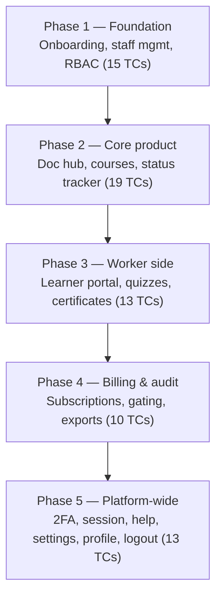

# Theraptly LMS — QA Testing Phases

> Companion to [`qa-test-cases.md`](./qa-test-cases.md). The 70 test cases (TC-001 – TC-070) are executed in five sequential phases. Each phase builds on state created by the previous one (accounts → content → learner activity → billing states → cross-cutting checks), so run them in order.

## Phase overview

| Phase | Focus | Test case sections | TC IDs | Count |
| --- | --- | --- | --- | --- |
| 1 — Foundation | Accounts, org setup, access control | Admin — Onboarding · Admin — Staff Management · Admin — RBAC | TC-001–006, TC-026–031, TC-042–044 | 15 |
| 2 — Core product | Content pipeline and tracking | Admin — Document Hub · Admin — Courses · Admin — Status Tracker | TC-007–025 | 19 |
| 3 — Worker side | Learner experience end-to-end | Worker Side | TC-045–057 | 13 |
| 4 — Billing & audit | Subscriptions, feature gating, exports | Admin — Billing · Admin — Audit | TC-032–041 | 10 |
| 5 — Platform-wide | Cross-cutting security and UX | 2FA · Session Timeout · Help Center · Settings · Profile Editing · Logging Out | TC-058–070 | 13 |

**Total: 70 test cases.** The source phase diagram lists Phase 5 as ~11 TCs; this plan also assigns the two Platform-Wide — Profile Editing cases (TC-067, TC-068) to Phase 5 so every case in the catalog belongs to exactly one phase.

Apply the [General QA Guidelines](./qa-test-cases.md#general-qa-guidelines-apply-to-every-test-case) (happy path first, state-change verification, copy quality) in every phase.

---

## Phase 1 — Foundation

**Scope:** admin signup (Microsoft + email), email verification, staff invites (email + CSV), role assignment, staff CRUD, and role-based access control.

| Section | Test cases |
| --- | --- |
| [Admin — Onboarding](./qa-test-cases.md#admin--onboarding) | TC-001 – TC-006 |
| [Admin — Staff Management](./qa-test-cases.md#admin--staff-management) | TC-026 – TC-031 |
| [Admin — RBAC](./qa-test-cases.md#admin--rbac-role-based-access-control) | TC-042 – TC-044 |

**Why first:** every later phase needs verified admin accounts, invited workers, and correctly scoped roles. RBAC failures found here invalidate permission assumptions in all subsequent phases.

**Exit condition:** an admin account and at least one invited worker per role exist, and each role's permission boundaries are verified.

## Phase 2 — Core product

**Scope:** document upload (format restrictions, PHI detection, compliance confirmation, reader, rename/delete), course creation and configuration (assignment, recurrence, reminders/escalations, video courses), and status tracking with reminder/escalation notifications.

| Section | Test cases |
| --- | --- |
| [Admin — Document Hub](./qa-test-cases.md#admin--document-hub) | TC-007 – TC-012 |
| [Admin — Courses](./qa-test-cases.md#admin--courses) | TC-013 – TC-021 |
| [Admin — Status Tracker](./qa-test-cases.md#admin--status-tracker) | TC-022 – TC-025 |

**Why second:** courses are built from Document Hub content and assigned to the staff created in Phase 1; the status tracker only has data once courses with deadlines exist.

**Exit condition:** at least one document-based and one video course exist, assigned to workers with deadlines that exercise the reminder and escalation windows.

## Phase 3 — Worker side

**Scope:** the learner journey — invite acceptance and onboarding, viewing assigned courses, taking assessments, retake limits and quiz gating, admin alerts and reassignment, certificates after attestation, and the worker profile/grades views.

| Section | Test cases |
| --- | --- |
| [Worker Side](./qa-test-cases.md#worker-side) | TC-045 – TC-057 |

**Why third:** workers act on the assignments created in Phase 2. Quiz-gating cases (TC-051 – TC-054) depend on the retake limits configured during course creation (TC-014).

**Exit condition:** at least one worker has completed a course through attestation and certificate issuance, and one worker has exercised the fail-limit → gate → admin-reassign loop.

## Phase 4 — Billing & audit

**Scope:** subscribing, switching/updating/pausing/cancelling plans, invoice and billing-history accuracy, payment methods, subscription-state feature gating, and audit-log exports with date-range filters.

| Section | Test cases |
| --- | --- |
| [Admin — Audit](./qa-test-cases.md#admin--audit) | TC-032 – TC-033 |
| [Admin — Billing](./qa-test-cases.md#admin--billing) | TC-034 – TC-041 |

**Why fourth:** audit exports (TC-032 – TC-033) need the worker and course activity generated in Phases 2–3 to have meaningful content, and the gating case (TC-041) deliberately breaks access to course creation, assignment, audits, and the learner portal — running it earlier would corrupt the state the other phases depend on.

**Exit condition:** each subscription state (active, paused, cancelled, downgraded) has been verified against its feature gates, and audit exports match actual activity. Restore an active subscription before Phase 5.

## Phase 5 — Platform-wide

**Scope:** cross-cutting concerns that apply to every account type — 2FA enable/verify/disable, session timeout and activity reset, Help Center content and search, Settings copy and persistence, profile editing and validation, and logout with protected-route enforcement.

| Section | Test cases |
| --- | --- |
| [Platform-Wide — Two-Factor Authentication (2FA)](./qa-test-cases.md#platform-wide--two-factor-authentication-2fa) | TC-058 – TC-060 |
| [Platform-Wide — Session Timeout](./qa-test-cases.md#platform-wide--session-timeout) | TC-061 – TC-062 |
| [Platform-Wide — Help Center](./qa-test-cases.md#platform-wide--help-center) | TC-063 – TC-064 |
| [Platform-Wide — Settings](./qa-test-cases.md#platform-wide--settings) | TC-065 – TC-066 |
| [Platform-Wide — Profile Editing](./qa-test-cases.md#platform-wide--profile-editing) | TC-067 – TC-068 |
| [Platform-Wide — Logging Out](./qa-test-cases.md#platform-wide--logging-out) | TC-069 – TC-070 |

**Why last:** these checks interfere with active test sessions (2FA prompts, forced timeouts, logout) and are account-agnostic, so they run once the functional flows are already verified. TC-058 – TC-062 are inferred baseline coverage (no bullets in the source stories) — treat unexpected behavior here as a finding to confirm with the team rather than an automatic failure.

**Exit condition:** all 70 test cases have a recorded PASS/FAIL result.

---

## Retest policy

When a change lands that affects a phase's area, retest that phase's affected TCs — and any later phase that consumes its state (e.g. a course-creation change invalidates Phase 3 results built on those courses). A prior PASS is stale the moment the underlying behavior changes.
