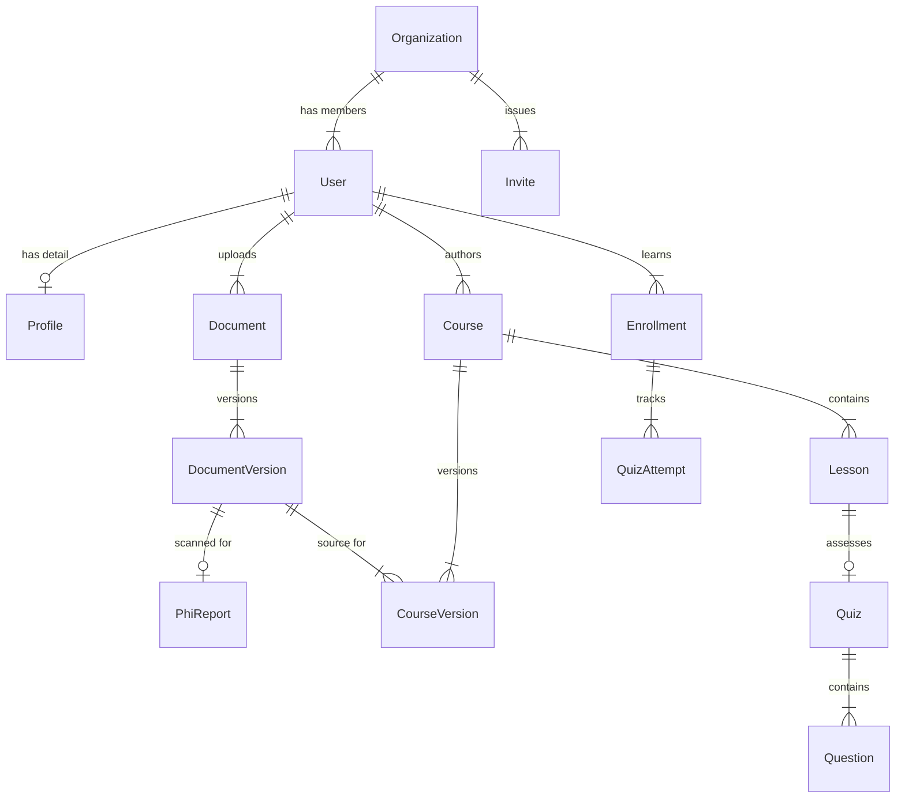

# System Architecture Documentation

**Project Name:** LMS2 (Theraplty Learning Management System)
**Version:** 0.1.0
**Date:** February 17, 2026

## 1. Executive Summary
LMS2 is a modern, enterprise-grade Learning Management System designed for healthcare compliance and organizational training. It features multi-tenancy (via organizations), role-based access control, AI-powered course generation from compliance documents, and automated PHI (Protected Health Information) detection.

## 2. Technology Stack

### Frontend
- **Framework:** [Next.js 16.1.6](https://nextjs.org/) (App Router, Turbopack)
- **Library:** [React 19](https://react.dev/)
- **Styling:** CSS Modules (with scoped classes), Framer Motion for animations.
- **State Management:** React Server Actions (for mutations), React Hooks (local state).
- **Visualization:** Recharts (for analytics dashboards).
- **Rich Text Editor:** React Quill New.

### Backend (Serverless / Edge)
- **Runtime:** Node.js (via Next.js Server Actions & API Routes).
- **Database ORM:** [Prisma ORM](https://www.prisma.io/).
- **Authentication:** [NextAuth.js v5 (Beta 30)](https://authjs.dev/) - Credential-based provider with JWT sessions.
- **AI Engine:** Google Cloud Vertex AI (`@google-cloud/vertexai`) for content generation.
- **Document Processing:** `pdf-parse`, `mammoth` (for DOCX), `xlsx`.

### Infrastructure
- **Database:** PostgreSQL.
- **Process Management:** PM2 (running `npm run start`).
- **Web Server / Proxy:** Nginx (Reverse Proxy with SSL termination capabilities).
- **Tunneling:** Cloudflare Tunnel (`cloudflared`) for exposing local/staging environments securely.
- **Email:** Nodemailer (SMTP via Zoho).

---

## 3. High-Level Architecture Diagram

```mermaid
graph TD
    Client[Client Browser] -->|HTTPS| CF[Cloudflare Tunnel]
    CF -->|Tunnel| Nginx[Nginx Proxy]
    Nginx -->|HTTP :3000| NextApp[Next.js App Server (PM2)]
    
    subgraph "Application Layer (Next.js)"
        NextApp -->|Auth| NextAuth[NextAuth.js]
        NextApp -->|ORM| Prisma[Prisma Client]
        NextApp -->|AI Requests| VertexAI[Vertex AI Integration]
        NextApp -->|File Parsing| Parsers[PDF/Docx Parsers]
    end
    
    subgraph "Data Layer"
        Prisma -->|SQL| DB[(PostgreSQL)]
        NextApp -->|File System| Uploads[Local Uploads /public]
    end
    
    subgraph "External Services"
        VertexAI -->|API| GoogleCloud[Google Vertex AI]
        NextApp -->|SMTP| ZohoMail[Zoho Mail]
    end
```

---

## 4. Database Schema Design
The database is normalized and designed for multi-tenancy.

### Core Entity Relationship Diagram (Mermaid)



### Key Models Description

1.  **Organization**
    - The tenant root. Contains business details (EIN, Address) and settings (HIPAA compliance flags).
    - Unique `slug` for identification.
    - `joinCode` for easy worker onboarding.

2.  **User & Profile**
    - **User:** Authentication credentials (hashed password), Role (`admin` | `worker`), Email verification status.
    - **Profile:** Personal details (Avatar, Job Title) separated to keep the User table lightweight.

3.  **Document System**
    - **Document:** Metadata container (filename, mimeType).
    - **DocumentVersion:** Immutable version of a file. Stores the `hash` (SHA-256) for integrity and the extracted text content.
    - **PhiReport:** Security feature. Links 1:1 with DocumentVersion. Stores boolean `hasPHI` and JSON locations of detected sensitive data.

4.  **Course Engine**
    - **Course:** The educational unit. Contains metadata target audience/category.
    - **Lesson:** Content units (HTML/Markdown).
    - **Quiz:** Assessment unit linked to a Lesson. Supports multiple question types.

5.  **Enrollment**
    - Link table between `User` and `Course`. Tracks `status`, `progress` (%), and `score`.
    - Includes **Attestation** fields for compliance (digital signatures).

---

## 5. Key System Modules

### A. Authentication & Authorization
- **Implementation:** `src/auth.config.ts`, `src/check-permissions.ts`.
- **Strategy:** credentials-based login.
- **RBAC:** Middleware protects routes based on `session.user.role`.
    - `admin`: Full access to organization settings, course creation, user management.
    - `worker`: Access to assigned courses ("My Learning") and profile.

### B. AI Course Generator (The "Wizard")
- **Workflow:**
    1.  **Upload:** User uploads a policy intent (PDF/DOCX).
    2.  **Versioning:** System creates `DocumentVersion`, hashes it, and extracts text.
    3.  **PHI Scan:** Text is scanned for PHI (Regex/AI) -> `PhiReport` created.
    4.  **AI Generation:** Vertex AI analyzes the text and generates:
        - Course Outline (Modules/Lessons).
        - Content (HTML/Rich Text).
        - Quiz Questions.
    5.  **Review (Step 5):** User reviews generated content in 'Slide' or 'Article' view.
    6.  **Publish:** Course moves from 'draft' to 'published'.

### C. Compliance Mapping
- **Purpose:** Links uploaded policy documents to specific regulatory standards (e.g., CARF, HIPAA).
- **Model:** `MappingEvidence`.
- **Function:** Allows auditors to see exactly which snippet of a document satisfies a specific regulation.

---

## 6. Security & Infrastructure Details

- **Environment Config:** Managed via `.env` (contains sensitive keys like database URL, NextAuth secret, Google credentials).
- **Nginx Config:** 
    - Reverse Proxy to localhost:3000.
    - **Timeouts:** Extended `proxy_read_timeout` (300s) to handle long-running AI requests.
    - **Uploads:** Increased `client_max_body_size` (20M) for large PDF manuals.
- **Server Actions:**
    - Type-safe backend logic.
    - Validation using `zod` schemas.
    - `maxDuration` set to 300s for AI-heavy actions.
- **Passwords:** Hashed using `bcryptjs`.

## 7. Folder Structure Highlights
```text
/src
  /app              # Next.js App Router Pages & API Routes
    /actions        # Server Actions (Backend Logic)
    /api            # REST Endpoints (for specific integrations)
    /dashboard      # Protected Application Routes
    /join/[token]   # Public Invite Flow
  /components
    /ui             # Reusable Atoms (Buttons, Inputs)
    /dashboard      # Feature-specific Organisms
  /lib
    /documents      # File handling logic
    /prisma.ts      # DB Client Singleton
  auth.ts           # Auth Library Initialization
  middleware.ts     # Route Protection Logic
```
